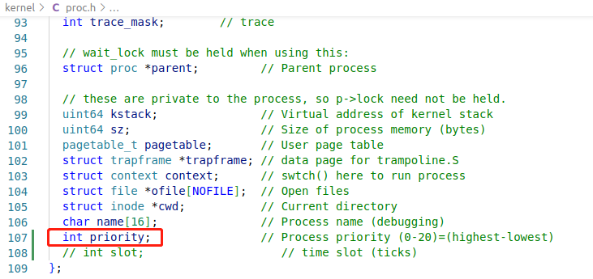
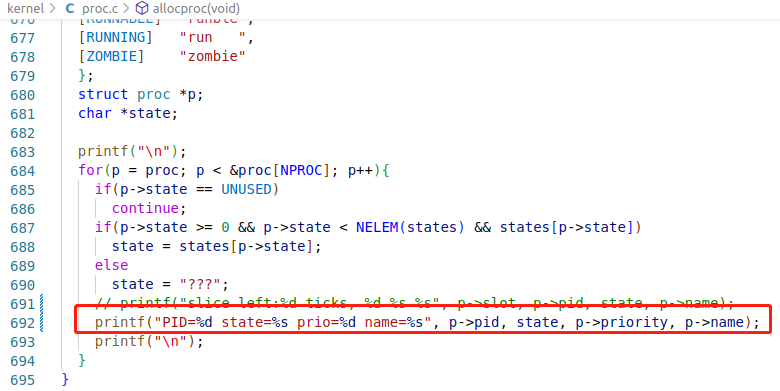
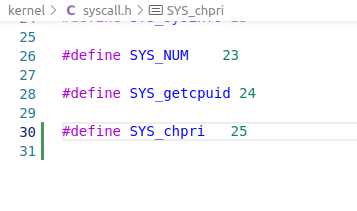
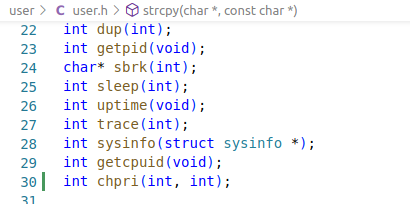
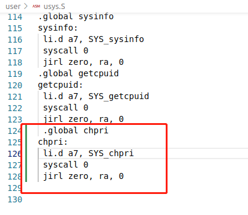
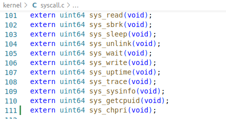
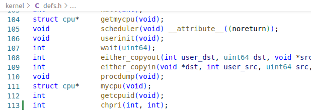
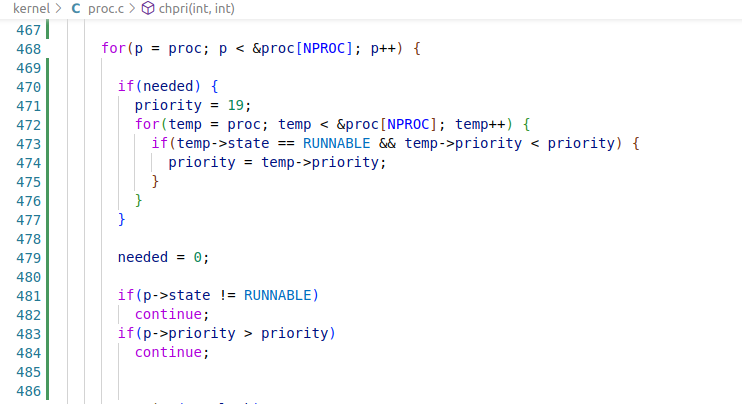
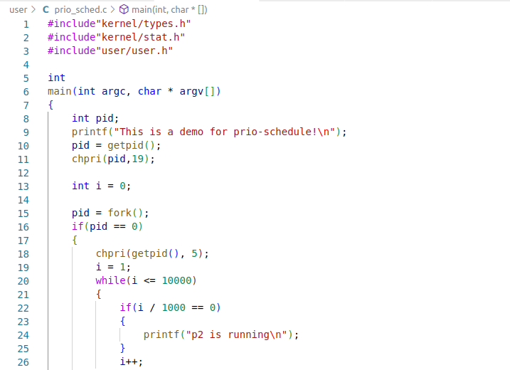
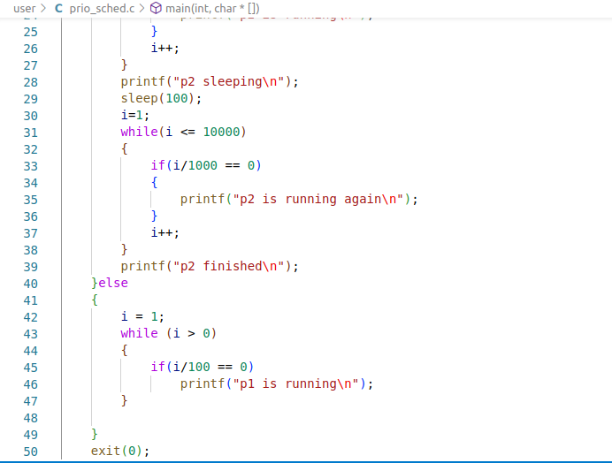

# 优先级调度

## 增加优先级属性

1. 在proc.h中修改结构体，增加priority属性
2. 在proc.c中修改allocproc函数，设置默认优先级
3. 修改procdump函数，以便观察进程优先级

## 设置优先级

1. 在syscall.h中定义新系统调用
2. 在user.h中添加原型函数
3. 在usys.S添加汇编代码实现
4. 在syscall.c中修改跳转表，添加外部函数声明
5. 在sysproc.c实现sys_chpri函数
6. 在proc.c实现chpri函数
7. 在defs.h添加函数原型

## 修改调度器

修改scheduler调度器，每次选择可调度的优先级最高的进程

## 验证优先级调度

1. 编写程序，两个优先级不同的进程同时执行，观察其调度情况。

   

2. 验证调度的正确性：p2先执行->p2睡眠，p1执行->p2继续执行->p2结束，p1执行